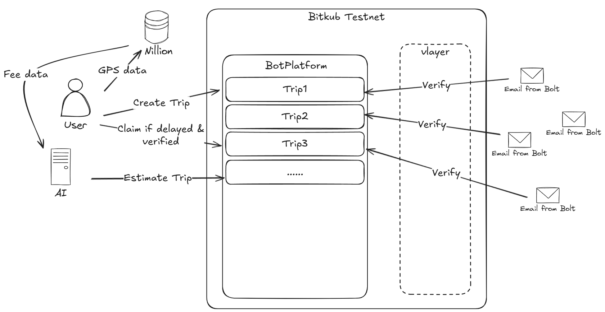

# BOT (BangkokOnTime)



## vLayer

We use vlayer to generate an EmailProof from the Bolt's email, [here](https://github.com/0xja-eth/BOT-vLayer-Server) is the code for the vLayer server in BOT.

The EmailProof will proof the date, pickup time and dropoff time of the trip, we use this info to verify the trip data (e.g. startTime, endTime, ...) the user sent on chain during the trip.

We use a [Regexp](https://github.com/0xja-eth/BOT-vLayer-Server/blob/d54d45a5b834dd47fd6f1a0a3569e42b32d09090/src/vlayer/EmailProver.sol#L46) to match the info from the email, and then we use the vlayer to generate the EmailProof.

Because the info matched from the email is a string like "15 November 2024", to compare the date and time with the trip data on chain, we need to convert the string to timestamp, we wrote an util [function](https://github.com/0xja-eth/BOT-vLayer-Server/blob/d54d45a5b834dd47fd6f1a0a3569e42b32d09090/src/vlayer/EmailProofVerifier.sol#L49) to do this on chain.

## BOT Platform

The [BOTPlatform](https://github.com/0xja-eth/BOT-Contract/blob/main/src/BOTPlatform.sol) is our main contract. User create a trip on the platform, and the estimator (driven by AI) will estimate the endTime of the trip. 

If the actual endTime of the trip (verified by EmailProof) is later than the estimated endTime, the user will get a compensation. They can claim at any time after the trip ends.

User must upload the email from Bolt to prove their trip is delayed. If not, the user will not get any compensation.

## Bitkub

All the contracts are deployed on the Bitkub Testnet. The contract addresses are:

```json
{
  "USDC": "0x165eEEDc8D9eF353D68115260cCFE8a593EC7552", // KAP20
  "BOTPlatform": "0xf096540C98E4aAF943C0C1616dCdb81Df848d775",
  "EmailProver": "0xd726bca8fde31d8c1f918a3be12c4ceefe82f39e",
  "EmailProofVerifier": "0x6e18cef18cbf6ceb96a52ab71f5330c4f312cf47"
}
```

We make some efforts to deploy vlayer on Bitkub Testnet, in the help of vlayer and Bitkub, we finally make it work., 
